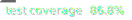
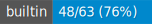
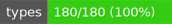
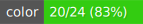
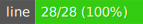
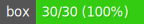
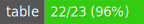
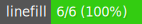
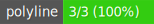

<p align="center">
  
</p>

<p align="center">
  <strong>Run Pine Script Anywhere</strong><br>
  Execute TradingView indicators in Node.js, browsers, and any JavaScript runtime<br />
PineTS enables algorithmic traders, quant developers and platforms to integrate Pine Script logic directly into their infrastructure.  
  
</p>

<p align="center">
  <a href="https://www.npmjs.com/package/pinets"></a>
  <a href="#license"></a>
  <a href="./.github/badges/coverage.svg"></a>
  <a href="https://quantforgeorg.github.io/PineTS/"></a>
</p>

<p align="center">
  <a href="#quick-start">Quick Start</a> •
  <a href="#features">Features</a> •
  <a href="#usage">Usage</a> •
  <a href="#api-coverage">API Coverage</a> •
  <a href="#documentation">Docs</a>
</p>

---

## What is PineTS?

**PineTS** is an open-source transpiler and runtime that seamlessly bridges Pine Script and the JavaScript ecosystem. Develop your indicators once and deploy them everywhere : on your servers, in the browser, or fully integrated into your trading platforms.

```javascript
import { PineTS, Provider } from 'pinets';

const pineTS = new PineTS(Provider.Binance, 'BTCUSDT', '1h', 100);

// Run native Pine Script directly
const { plots } = await pineTS.run(`
//@version=5
indicator("EMA Cross")
plot(ta.ema(close, 9), "Fast", color.blue)
plot(ta.ema(close, 21), "Slow", color.red)
`);
```

> **About Pine Script™?**  
> [Pine Script™](https://www.tradingview.com/pine-script-docs/welcome/) is a domain-specific programming language created by TradingView for writing custom technical analysis indicators and strategies.

> _**Disclaimer** : PineTS is an independent project and is not affiliated with, endorsed by, or associated with TradingView or Pine Script™. All trademarks and registered trademarks mentioned belong to their respective owners._

---

## Why PineTS?

| Challenge                                   | PineTS Solution                                      |
| ------------------------------------------- | ---------------------------------------------------- |
| Pine Script only runs on TradingView        | Run indicators on your own infrastructure            |
| Can't integrate indicators with custom apps | Full JavaScript/TypeScript integration               |
| Limited to TradingView's data sources       | Use any data source (Binance, custom APIs, CSV)      |
| No programmatic access to indicator values  | Get raw values for backtesting, alerts, ML pipelines |
| Can't run indicators server-side            | Works in Node.js, Deno, Bun, browsers                |

---

## Quick Start

### Installation

```bash
npm install pinets
```

### Hello World

```javascript
import { PineTS, Provider } from 'pinets';

// Initialize with Binance data
const pineTS = new PineTS(Provider.Binance, 'BTCUSDT', '1h', 100);

// Calculate a simple moving average
const { plots } = await pineTS.run(`
//@version=5
indicator("My First Indicator")
sma20 = ta.sma(close, 20)
plot(sma20, "SMA 20")
`);

console.log('SMA values:', plots['SMA 20'].data);
```

**That's it!** You're running Pine Script in JavaScript.

---

## Features

### Core Capabilities

- **Native Pine Script v5/v6** : Run original TradingView code directly _(experimental)_
- **60+ Technical Indicators** : SMA, EMA, RSI, MACD, Bollinger Bands, and more
- **Time-Series Processing** : Full Pine Script semantics with lookback support
- **Real-time Streaming** : Live data processing with event-based updates
- **Multi-Timeframe Analysis** : `request.security()` for MTF indicators
- **High Precision** : Matches TradingView's calculation precision

### Two Ways to Write Indicators

<table width="100%">
<tr>
<th>Native Pine Script</th>
<th>PineTS Syntax (JavaScript)</th>
</tr>
<tr>
<td>

```pinescript
//@version=5
indicator("RSI Strategy")

rsi = ta.rsi(close, 14)
sma = ta.sma(rsi, 10)

plot(rsi, "RSI")
plot(sma, "Signal")
```

</td>
<td>

```javascript
//@PineTS
indicator('RSI Strategy');

const rsi = ta.rsi(close, 14);
const sma = ta.sma(rsi, 10);

plot(rsi, 'RSI');
plot(sma, 'Signal');
```

</td>
</tr>
</table>

---

## Usage

### Running Native Pine Script

```javascript
import { PineTS, Provider } from 'pinets';

const pineTS = new PineTS(Provider.Binance, 'BTCUSDT', 'D', 200);

const { plots } = await pineTS.run(`
//@version=5
indicator("MACD", overlay=false)

[macdLine, signalLine, hist] = ta.macd(close, 12, 26, 9)

plot(macdLine, "MACD", color.blue)
plot(signalLine, "Signal", color.orange)
plot(hist, "Histogram", color.gray, style=plot.style_histogram)
`);

// Access the calculated values
console.log('MACD Line:', plots['MACD'].data);
console.log('Signal Line:', plots['Signal'].data);
```

### Using PineTS Syntax

```javascript
import { PineTS, Provider } from 'pinets';

const pineTS = new PineTS(Provider.Binance, 'ETHUSDT', '4h', 100);

const { plots } = await pineTS.run(($) => {
    const { close, high, low } = $.data;
    const { ta, plot, plotchar } = $.pine;

    // Calculate indicators
    const ema9 = ta.ema(close, 9);
    const ema21 = ta.ema(close, 21);
    const atr = ta.atr(14);

    // Detect crossovers
    const bullish = ta.crossover(ema9, ema21);
    const bearish = ta.crossunder(ema9, ema21);

    // Plot results
    plot(ema9, 'Fast EMA');
    plot(ema21, 'Slow EMA');
    plotchar(bullish, 'Buy Signal');
    plotchar(bearish, 'Sell Signal');

    return { ema9, ema21, atr, bullish, bearish };
});
```

### Real-time Streaming

```javascript
import { PineTS, Provider } from 'pinets';

const pineTS = new PineTS(Provider.Binance, 'BTCUSDT', '1m');

const stream = pineTS.stream(
    `
    //@version=5
    indicator("Live RSI")
    plot(ta.rsi(close, 14), "RSI")
    `,
    { live: true, interval: 1000 },
);

stream.on('data', (ctx) => {
    const rsi = ctx.plots['RSI'].data.slice(-1)[0].value;
    console.log(`RSI: ${rsi.toFixed(2)}`);

    if (rsi < 30) console.log('Oversold!');
    if (rsi > 70) console.log('Overbought!');
});

stream.on('error', (err) => console.error('Stream error:', err));
```

### Custom Data Source

```javascript
import { PineTS } from 'pinets';

// Your own OHLCV data
const candles = [
    { open: 100, high: 105, low: 99, close: 103, volume: 1000, openTime: 1704067200000 },
    { open: 103, high: 108, low: 102, close: 107, volume: 1200, openTime: 1704153600000 },
    // ... more candles
];

const pineTS = new PineTS(candles);

const { plots } = await pineTS.run(`
//@version=5
indicator("Custom Data")
plot(ta.sma(close, 10))
`);
```

---

## API Coverage

PineTS aims for complete Pine Script API compatibility. Current status:

### Data & Context

[](https://quantforgeorg.github.io/PineTS/api-coverage/syminfo.html)
[](https://quantforgeorg.github.io/PineTS/api-coverage/barstate.html)
[](https://quantforgeorg.github.io/PineTS/api-coverage/timeframe.html)
[](https://quantforgeorg.github.io/PineTS/api-coverage/ticker.html)
[](https://quantforgeorg.github.io/PineTS/api-coverage/builtin.html)
[](https://quantforgeorg.github.io/PineTS/api-coverage/session.html)

### Technical Analysis & Math

[](https://quantforgeorg.github.io/PineTS/api-coverage/ta.html)
[](https://quantforgeorg.github.io/PineTS/api-coverage/math.html)
[](https://quantforgeorg.github.io/PineTS/api-coverage/request.html)
[](https://quantforgeorg.github.io/PineTS/api-coverage/input.html)

### Data Structures

[](https://quantforgeorg.github.io/PineTS/api-coverage/array.html)
[](https://quantforgeorg.github.io/PineTS/api-coverage/matrix.html)
[](https://quantforgeorg.github.io/PineTS/api-coverage/map.html)
[](https://quantforgeorg.github.io/PineTS/api-coverage/types.html)

### Visualization

[](https://quantforgeorg.github.io/PineTS/api-coverage/plots.html)
[](https://quantforgeorg.github.io/PineTS/api-coverage/color.html)
[](https://quantforgeorg.github.io/PineTS/api-coverage/chart.html)
[](https://quantforgeorg.github.io/PineTS/api-coverage/label.html)
[](https://quantforgeorg.github.io/PineTS/api-coverage/line.html)
[](https://quantforgeorg.github.io/PineTS/api-coverage/box.html)
[](https://quantforgeorg.github.io/PineTS/api-coverage/table.html)
[](https://quantforgeorg.github.io/PineTS/api-coverage/linefill.html)
[](https://quantforgeorg.github.io/PineTS/api-coverage/polyline.html)

### Utilities

[](https://quantforgeorg.github.io/PineTS/api-coverage/str.html)
[](https://quantforgeorg.github.io/PineTS/api-coverage/log.html)
[](https://quantforgeorg.github.io/PineTS/api-coverage/strategy.html)

> Click any badge to see detailed function-level coverage

---

## Documentation

- **[Full Documentation](https://quantforgeorg.github.io/PineTS/)** — Complete guides and API reference
- **[Initialization Guide](https://quantforgeorg.github.io/PineTS/initialization-and-usage/)** — Setup options and configuration
- **[Architecture Overview](https://quantforgeorg.github.io/PineTS/architecture/)** — How PineTS works internally
- **[API Coverage Details](https://quantforgeorg.github.io/PineTS/api-coverage/)** — Function-by-function compatibility

---

## Use Cases

**Algorithmic Trading**

- Build custom trading bots using Pine Script strategies
- Integrate indicators with your execution systems

**Backtesting**

- Test Pine Script strategies against historical data
- Export indicator values for analysis in Python/R

**Alert Systems**

- Create custom alert pipelines based on indicator signals
- Monitor multiple assets with server-side indicator calculations

**Research & Analysis**

- Process large datasets with Pine Script indicators
- Feed indicator outputs into machine learning models

**Custom Dashboards**

- Embed live indicators in web applications
- Build real-time monitoring dashboards

---

## Roadmap

| Status | Feature                                   |
| ------ | ----------------------------------------- |
| ✅     | Native Pine Script v5/v6 support          |
| ✅     | 60+ technical analysis functions          |
| ✅     | Arrays, matrices, and maps                |
| ✅     | Real-time streaming                       |
| ✅     | Multi-timeframe with `request.security()` |
| 🚧     | Strategy backtesting engine               |
| 🚧     | Additional data providers                 |
| 🎯     | Pine Script v6 full compatibility         |
| 🎯     | Market data Providers                     |
| 🎯     | Trading Connectors                        |

---

## Contributing

Contributions are welcome! Whether it's:

- Adding missing Pine Script functions
- Improving documentation
- Fixing bugs
- Suggesting features

Please feel free to open issues or submit pull requests.

---

## Contributors

See [CONTRIBUTING.md](CONTRIBUTING.md) for the full guidelines.

Thanks to all PineTS contributors:

<p align="left">
  <a href="https://github.com/alaa-eddine"></a> 
  <a href="https://github.com/dcaoyuan"></a> 
<a href="https://github.com/C9Bad"></a> 
<a href="https://github.com/aakash-code"></a>

</p>

---

## License

PineTS is dual-licensed:

- **[AGPL-3.0](./LICENSE)** — Free for everyone. You can use PineTS for personal projects, research, and internal tools without any obligation. The copyleft terms only apply if you **distribute** your application to others or **provide it as a network service** (e.g., SaaS, public API) — in that case, your full source code must also be released under AGPL-3.0.

- **[Commercial License](./LICENSE-COMMERCIAL.md)** — For companies and individuals who want to use PineTS in proprietary or closed-source software without AGPL-3.0 obligations. [Contact us for licensing](mailto:business@luxalgo.com).

---

<p align="center">
  <sub>Built with passion by <a href="https://www.luxalgo.com">LuxAlgo</a></sub>
</p>
